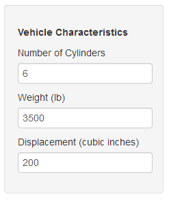
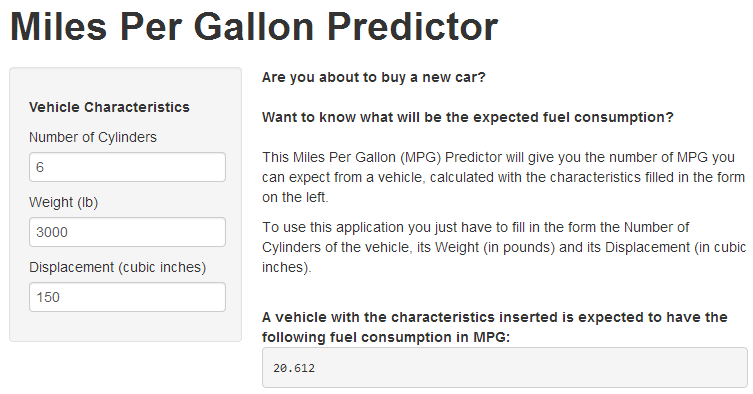

## Motivation

Are you about to buy a new car and don't know which one to choose?


Want to know what will be the expected fuel consumption for each option?


Don't trust the values provided by brands and want a second opinion?

--- .class #id 

## Miles Per Gallon Predictor

The Miles Per Gallon Predictor will give you an estimate for the number of miles
per gallon performance of a vehicle based on its characteristics.

You just have to insert the number of cylinders, weight (in pounds) and 
displacement (in cubic inches) and the application will give you the 
estimated number of miles per gallon.



--- .class #id 

## Examples

A couple of MPG predictions using this application

Cylinders | Weight (pounds) | Displacement (cubic inches)
--- | --- | ---
4 | 2000 | 90

Miles Per Gallon:
```{r, echo=FALSE}
data(mtcars)
fit <- lm(mpg ~ cyl + wt + disp, mtcars)
as.numeric(predict(fit, data.frame(cyl=4, wt=2, disp=90)))
```

___

Cylinders | Weight (pounds) | Displacement (cubic inches)
--- | --- | ---
8 | 3000 | 200

Miles Per Gallon:
```{r, echo=FALSE}
data(mtcars)
fit <- lm(mpg ~ cyl + wt + disp, mtcars)
as.numeric(predict(fit, data.frame(cyl=8, wt=3, disp=200)))
```

--- .class #id 

## Visit It

And the best part is: You can use the Miles Per Gallon completely for FREE!

Visit it at 
["http://jantonio.shinyapps.io/devdataprod-003/"](http://jantonio.shinyapps.io/devdataprod-003)
___


